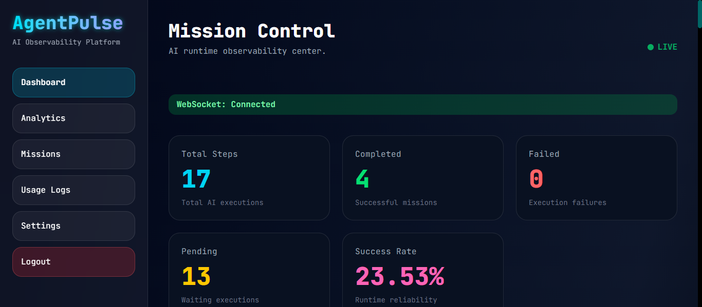
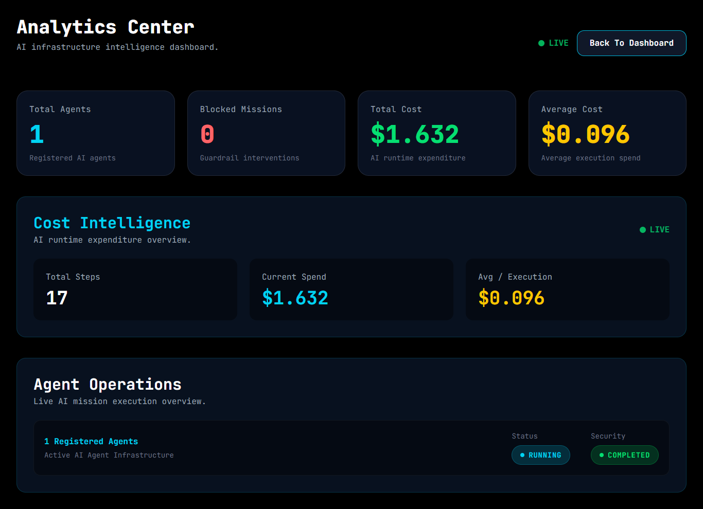
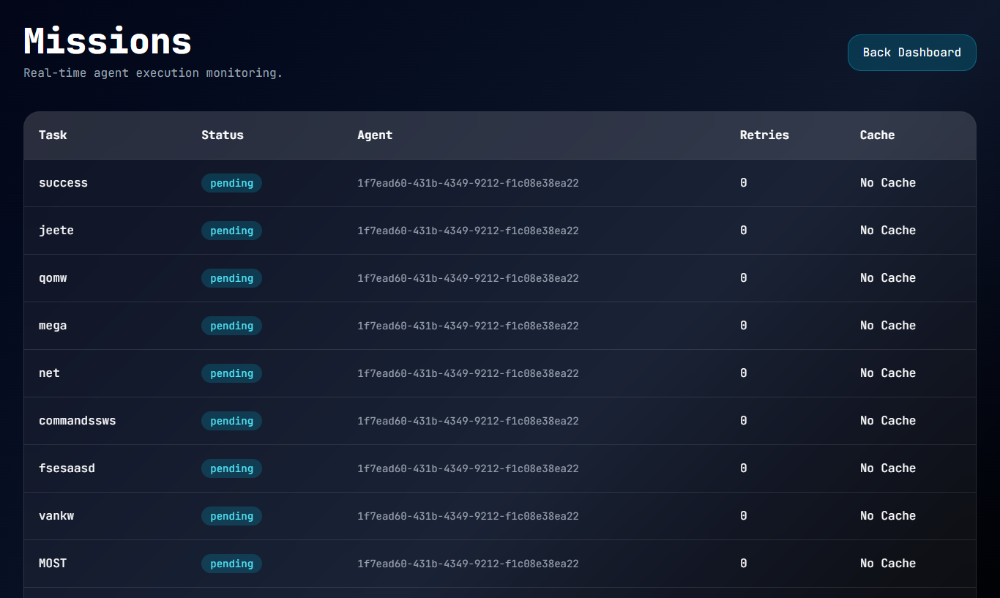
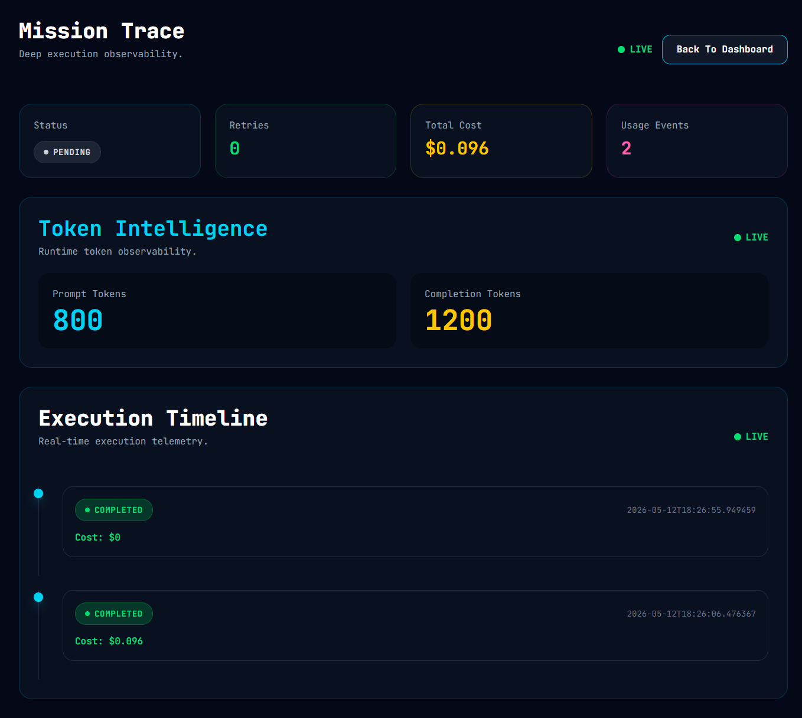
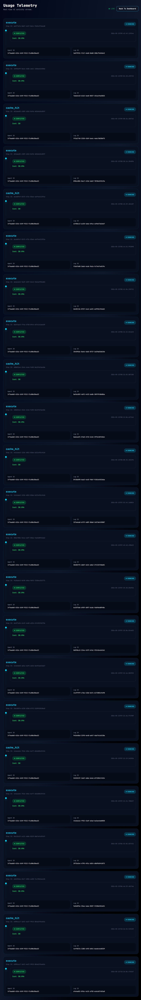
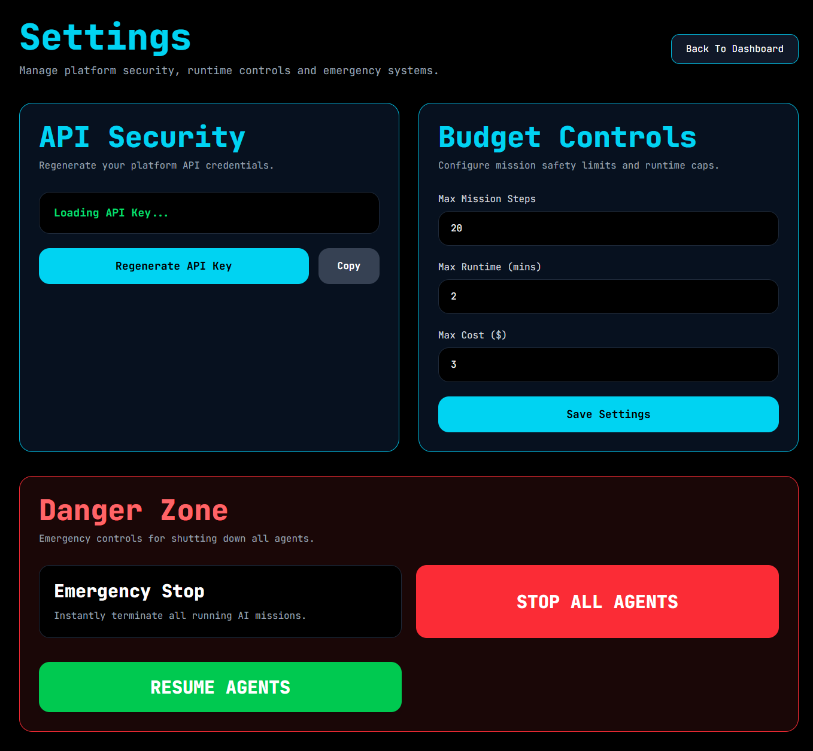
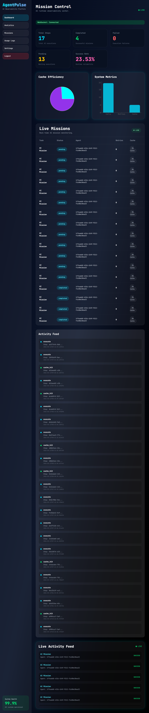

# Agent-Pulse

Agent-Pulse is an AI runtime orchestration, observability, and governance platform designed to monitor, control, and manage autonomous AI workflows in real time.

The platform provides durable task execution, distributed background processing, live runtime telemetry, mission tracing, governance controls, retry orchestration, and real-time execution visibility using FastAPI, Celery, Redis, PostgreSQL, WebSockets, and Docker.

Agent-Pulse focuses on solving one of the biggest challenges in modern AI systems:

> Running AI agents reliably, safely, observably, and controllably at scale.

---

# 🚀 Core Features

## 🔭 Runtime Observability

- Real-time mission monitoring
- Live execution telemetry
- WebSocket-powered dashboard updates
- Mission lifecycle tracking
- Step execution visibility
- Runtime execution analytics
- Mission summaries and metrics
- Worker activity monitoring
- Execution timelines
- Live activity feeds

---

## ⚙️ AI Workflow Orchestration

- Durable background execution
- Celery-based distributed worker architecture
- Redis-backed task queue system
- Concurrent workflow execution
- Retry orchestration engine
- Async execution pipelines
- Queue-driven execution model
- Worker lifecycle coordination
- Durable step execution
- Idempotent retry-safe execution model

---

## 🛡️ Runtime Governance & Controls

- Kill switch for active missions
- Runtime safeguard enforcement
- Dynamic retry limits
- Max-step execution protection
- Infinite-loop protection
- Repeated task detection
- Runtime execution guards
- Budget control architecture
- Safe execution boundaries
- Failure recovery workflows

---

## 📊 AI Runtime Analytics

- Token usage tracking
- Runtime cost monitoring
- Mission execution analytics
- Retry analytics
- Failure analytics
- Step performance metrics
- Worker execution visibility
- Execution throughput tracking
- Runtime telemetry aggregation

---

## 🧱 Durable Execution Architecture

- PostgreSQL-backed durable state
- Persistent mission storage
- Durable step persistence
- Execution recovery architecture
- Distributed worker coordination
- Background task infrastructure
- Queue durability model
- Async processing pipelines
- Execution replay-ready architecture

---

# 🧠 Why Agent-Pulse Exists

Modern AI agents are becoming increasingly autonomous and operationally complex.

However, most AI systems still lack:

- Runtime visibility
- Durable execution
- Governance controls
- Execution tracing
- Failure recovery
- Cost monitoring
- Safe orchestration
- Runtime telemetry
- Real-time observability

Agent-Pulse is designed to solve these problems by combining:

- observability,
- orchestration,
- governance,
- runtime analytics,
- and distributed execution

into a unified AI runtime platform.

---

# 🏗️ System Architecture

```text
User Request
      ↓
FastAPI API Layer
      ↓
Execution Guard Layer
      ↓
Redis Queue
      ↓
Celery Distributed Workers
      ↓
Mission / Step Execution
      ↓
PostgreSQL Durable State
      ↓
WebSocket Live Dashboard
```

---

# 🔄 Runtime Execution Flow

```text
Mission Created
      ↓
Mission Queued
      ↓
Worker Picks Task
      ↓
Step Execution Starts
      ↓
Telemetry Generated
      ↓
Mission State Persisted
      ↓
Dashboard Updated Live
      ↓
Governance Rules Applied
      ↓
Mission Completed / Failed
```

---

# 🛠️ Tech Stack

## Backend

- FastAPI
- SQLAlchemy
- Alembic
- PostgreSQL
- Celery
- Redis
- Python

---

## Frontend

- Next.js
- TypeScript
- Tailwind CSS
- Recharts

---

## Infrastructure

- Docker
- Docker Compose
- WebSockets
- Async Workers
- Distributed Queue System

---

# 📂 Project Structure

```bash
Agent-Pulse/
│
├── app/                     # Backend application
├── alembic/                 # Database migrations
├── frontend/                # Next.js frontend
├── docker-compose.yml
├── Dockerfile
├── requirements.txt
├── .env.example
├── .gitignore
└── README.md
```

---

# ⚙️ Environment Variables

Create a `.env` file in the root directory.

Example:

```env
DATABASE_URL=your_database_url
REDIS_URL=your_redis_url
SECRET_KEY=your_secret_key
ALGORITHM=HS256
OPENAI_API_KEY=your_openai_api_key
DEBUG=True
```

---

# 🐳 Running with Docker

Start all services:

```bash
docker compose up --build
```

Stop services:

```bash
docker compose down
```

---

# 💻 Local Development

## Backend

Install dependencies:

```bash
pip install -r requirements.txt
```

Run FastAPI server:

```bash
uvicorn app.main:app --reload
```

---

## Frontend

Move to frontend directory:

```bash
cd frontend
```

Install dependencies:

```bash
npm install
```

Start development server:

```bash
npm run dev
```

---

# 🧱 Database Migration

Run Alembic migrations:

```bash
alembic upgrade head
```

---

# 🌐 Application URLs

## Frontend

```bash
http://localhost:3000
```

## Backend

```bash
http://localhost:8000
```

## API Documentation

```bash
http://localhost:8000/docs
```

---

# 📡 Real-Time Runtime Features

## Mission Management

- Mission creation
- Mission tracking
- Mission execution monitoring
- Runtime mission analytics
- Mission telemetry collection

---

## Step Execution Engine

- Async step processing
- Retry-safe execution model
- Durable execution pipeline
- Concurrent execution support
- Worker coordination system

---

## Runtime Governance

- Mission stop controls
- Runtime guardrails
- Retry protection
- Execution safety limits
- Failure containment architecture

---

## Observability Dashboard

- Real-time telemetry
- Live mission updates
- Runtime analytics
- Worker execution visibility
- Runtime event monitoring

---

# 🔬 Load Testing & Scalability

The platform has been tested using concurrent execution and load-testing workflows to validate:

- Queue durability
- Worker orchestration
- Retry behavior
- Runtime safeguards
- Governance enforcement
- Distributed task execution
- Mission execution stability
- WebSocket telemetry handling

---

# 🧪 Engineering Concepts Used

- Distributed task orchestration
- Durable execution workflows
- Runtime governance systems
- Retry-safe execution architecture
- Real-time observability
- Queue-based execution systems
- Async execution pipelines
- AI runtime telemetry
- Distributed worker coordination
- Execution lifecycle monitoring

---

# 🚧 Future Roadmap

- Multi-agent coordination
- Agent memory systems
- Advanced workflow graphs
- MCP-compatible tool execution endpoints
- Distributed scaling architecture
- Production telemetry pipelines
- Kubernetes deployment
- Advanced observability tooling
- AI runtime tracing
- Cloud-native scaling support

---

# 📸 Screenshots

## Dashboard Overview

Real-time AI runtime observability dashboard with live WebSocket connectivity, mission telemetry, runtime analytics, and execution tracking.



---

## Runtime Analytics

Analytics dashboard showing execution metrics, cache efficiency, runtime telemetry, retries, and system health.



---

## Live Missions

Real-time mission execution monitoring with durable workflow tracking and mission lifecycle visibility.



---

## Mission Details

Detailed mission execution view including runtime traces, retries, token usage, and execution metadata.



---

## Usage Logs

Runtime activity feed and execution telemetry showing live agent events and observability logs.



---

## Settings & Governance

Runtime governance controls, configuration management, retry limits, and execution safeguards.



---

## Full Platform View

Complete observability platform showcasing orchestration, governance, analytics, mission control, and live telemetry systems.



# 👨‍💻 Author

Milan Charan

---

# 📄 License

All Rights Reserved.

This project is currently proprietary and not licensed for redistribution or commercial reuse.