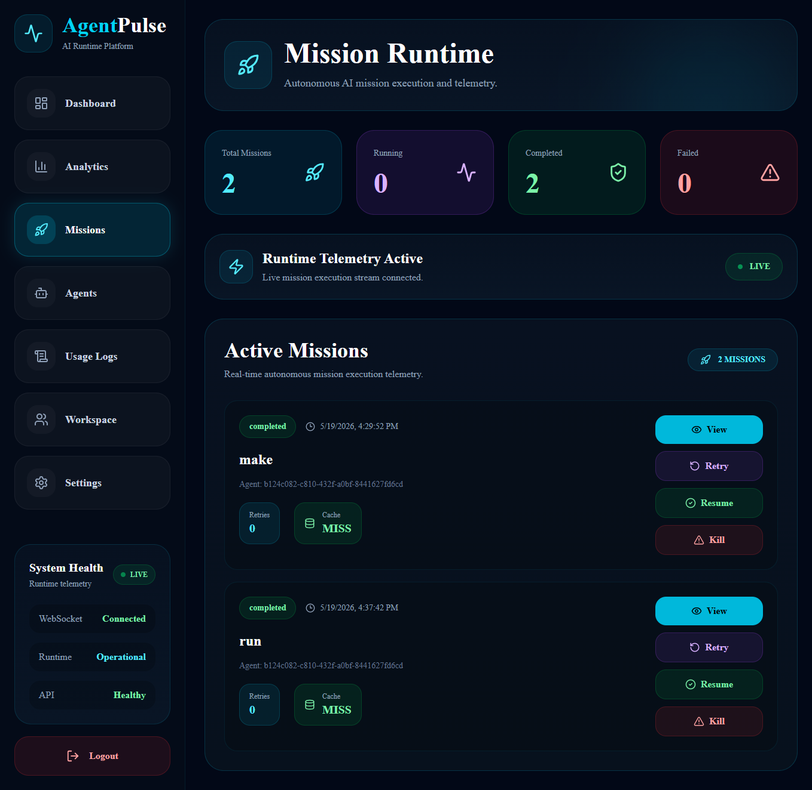
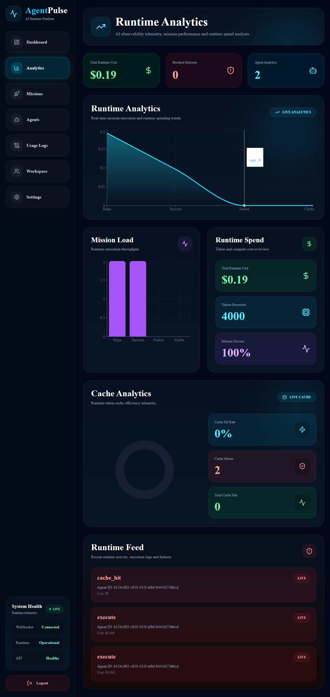
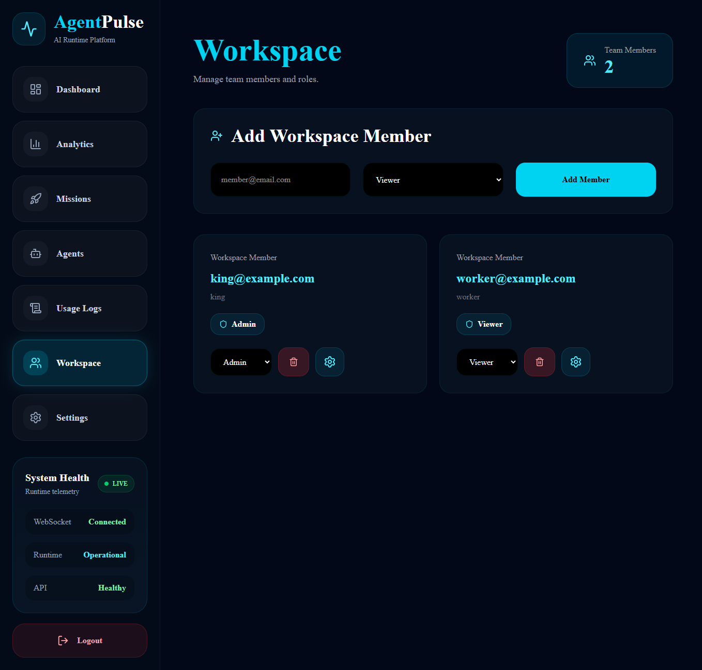
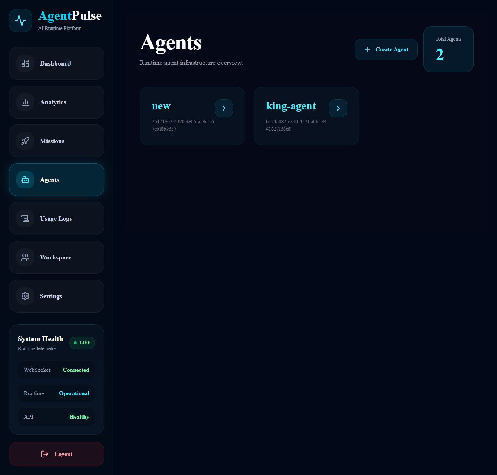
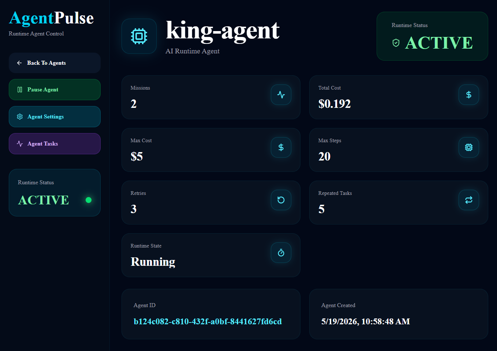
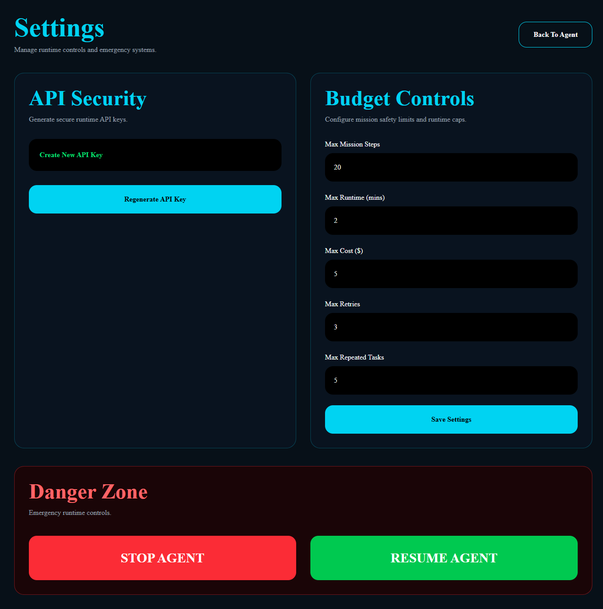
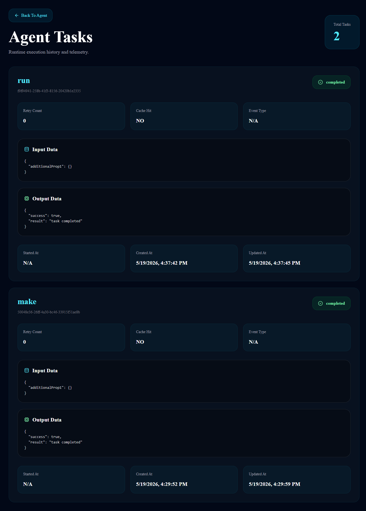

# Agent-Pulse

Agent-Pulse is an AI runtime orchestration, observability, governance, and execution-control platform designed for modern autonomous AI systems.

The platform provides durable task execution, distributed orchestration, runtime telemetry, mission tracing, governance enforcement, agent management, RBAC-based workspace collaboration, budget controls, execution analytics, and real-time operational visibility.

Built using FastAPI, Celery, Redis, PostgreSQL, WebSockets, Docker, and Next.js, Agent-Pulse focuses on solving one of the biggest operational challenges in modern AI systems:

Running AI agents reliably, observably, controllably, and safely at scale.

# 🚀 Platform Highlights

* Multi-tenant workspace architecture

* AI runtime orchestration

* Durable execution pipelines

* Real-time observability

* Agent lifecycle management

* Role-Based Access Control (RBAC)

* Runtime governance & safety controls

* Distributed worker execution

* Mission tracing & analytics

* Budget-aware AI execution

* Live WebSocket telemetry

* Retry-safe execution architecture

* Idempotent durable workflows

# 🧠 Why Agent-Pulse Exists

Modern AI systems are becoming increasingly autonomous, distributed, and operationally complex.

However, most AI workflows still lack:

* Runtime visibility

* Durable execution

* Governance controls

* Execution tracing

* Failure recovery

* Cost monitoring

* Multi-agent management

* Runtime analytics

* Safe orchestration

* Real-time observability

* Workspace collaboration

* Runtime control systems

Agent-Pulse is designed to unify:

* observability,

* orchestration,

* governance,

* analytics,

* durable execution,

* and runtime control

into a single operational AI runtime platform.

# 🏢 Multi-Tenant Workspace Architecture

Agent-Pulse now supports a fully workspace-based SaaS architecture.

Every:

* agent,

* mission,

* runtime event,

* task,

* usage metric,

* and governance operation

is securely isolated per workspace.

## Workspace Features

* Workspace-based tenant isolation

* Organization-style collaboration model

* Workspace membership system

* Workspace-aware APIs

* Secure workspace validation

* Workspace-scoped runtime telemetry

* Workspace-specific analytics

* Multi-organization support

# 🔐 Role-Based Access Control (RBAC)

Agent-Pulse includes backend-enforced RBAC infrastructure.

## Roles

### Admin

* Full platform access

* Agent creation

* Budget controls

* API key regeneration

* Runtime governance access

* Workspace member management

### Operator

* Operational runtime controls

* Kill/resume permissions

* Mission visibility

* Runtime monitoring

### Viewer

* Read-only access

* Runtime observability

* Analytics visibility

* Mission tracking

## Security Enforcement

* Backend role enforcement

* Workspace membership validation

* Protected runtime operations

* Permission-aware execution control

* Secure authorization layers

# 🤖 Agent Management System

Agent-Pulse includes a complete agent lifecycle management system.

## Agents Dashboard

* Real-time agent overview

* Workspace-scoped agents

* Responsive agents UI

* Agent runtime summaries

* Agent operational statistics

* Runtime state visibility

## Create Agent System

* Secure agent creation flow

* Runtime configuration support

* API key generation

* One-time API key visibility

* Copy API key functionality

* Workspace-bound agents

* Role-protected creation access

# 📄 Agent Detail Dashboard

Each agent includes a dedicated operational dashboard.

## Per-Agent Features

* Runtime details

* Agent metadata

* Agent status visibility

* Mission tracking

* Usage monitoring

* Budget controls

* API key regeneration

* Kill/resume controls

* Task visibility

* Runtime analytics

* Execution telemetry

# ⚙️ AI Workflow Orchestration

Agent-Pulse provides durable distributed orchestration infrastructure.

## Execution Features

* Durable background execution

* Celery distributed workers

* Redis-backed execution queues

* Concurrent workflow execution

* Async execution pipelines

* Queue-driven orchestration

* Worker lifecycle coordination

* Retry-safe execution model

* Durable step tracking

* Distributed task execution

# 🧱 Durable Execution System

The platform includes a durable runtime execution architecture.

## Durable Runtime Features

* Idempotent execution support

* Duplicate request prevention

* Cached execution reuse

* Durable step persistence

* Persistent mission state

* PostgreSQL-backed runtime state

* Execution replay-ready design

* Failure recovery architecture

* Runtime state synchronization

# 🛡️ Runtime Governance & Controls

Agent-Pulse includes runtime governance systems for operational AI safety.

## Governance Features

* Kill running agents

* Resume paused agents

* Runtime safeguard enforcement

* Dynamic retry controls

* Infinite-loop protection

* Repeated task detection

* Runtime execution guards

* Mission execution protection

* Safe execution boundaries

* Runtime control enforcement

* Failure containment architecture

# 💰 Budget Control System

Per-agent runtime budget management is built directly into the platform.

## Budget Features

* Runtime budget limits

* Agent-level budget control

* Usage restriction controls

* Runtime spend visibility

* AI usage monitoring

* Operational cost awareness

# 📋 Mission Runtime Infrastructure

Mission orchestration is a core operational layer inside Agent-Pulse.

## Mission Features

* Mission execution engine

* Step orchestration

* Mission lifecycle tracking

* Runtime mission visibility

* Durable mission execution

* Mission state persistence

* Mission telemetry collection

* Retry-aware execution tracking

# 🧩 Task Management System

Each agent contains task-level runtime visibility.

## Task Features

* Agent-specific task dashboard

* Runtime task monitoring

* Task execution tracking

* Input/output visibility

* Runtime timestamps

* Success/failure visibility

* Mission-linked task tracing

* Execution lifecycle tracking

# 📡 Real-Time Runtime Infrastructure

Agent-Pulse includes real-time runtime synchronization using WebSockets.

## Real-Time Features

* WebSocket connectivity

* Heartbeat monitoring

* Live runtime updates

* Real-time dashboard synchronization

* Runtime activity feeds

* Live mission telemetry

* Runtime event streaming

# 📊 Usage & Analytics System

The platform provides workspace-wide and agent-specific analytics.

## Analytics Features

* Usage event logging

* Cache-hit tracking

* Runtime analytics

* Agent activity monitoring

* Mission analytics

* Token usage tracking

* Runtime cost monitoring

* Execution metrics

* Retry analytics

* Failure analytics

* Runtime telemetry aggregation

* Throughput tracking

# 🔭 Runtime Observability

Agent-Pulse provides operational observability for AI systems.

## Observability Features

* Real-time mission monitoring

* Live execution telemetry

* Mission lifecycle tracking

* Runtime execution visibility

* Worker activity monitoring

* Execution timelines

* Runtime event monitoring

* Agent telemetry systems

* Distributed runtime analytics

# 🏗️ System Architecture

```text
User Request
      ↓
FastAPI API Layer
      ↓
Execution Guard Layer
      ↓
Workspace / RBAC Validation
      ↓
Redis Queue
      ↓
Celery Distributed Workers
      ↓
Mission / Step Execution
      ↓
PostgreSQL Durable State
      ↓
WebSocket Live Dashboard
```

# 🔄 Runtime Execution Flow

```text
Mission Created
      ↓
Workspace Validation
      ↓
Execution Policies Applied
      ↓
Mission Queued
      ↓
Worker Picks Task
      ↓
Step Execution Starts
      ↓
Telemetry Generated
      ↓
Mission State Persisted
      ↓
Dashboard Updated Live
      ↓
Governance Rules Applied
      ↓
Mission Completed / Failed
```

# 🛠️ Tech Stack

## Backend

* FastAPI

* Python

* SQLAlchemy

* Alembic

* PostgreSQL

* Celery

* Redis

* WebSockets

## Frontend

* Next.js App Router

* TypeScript

* Tailwind CSS

* Recharts

## Infrastructure

* Docker

* Docker Compose

* Async Workers

* Distributed Queue System

* Vercel Deployment

* Render Deployment

# 🔐 Security Features

* Workspace isolation

* RBAC enforcement

* Workspace membership validation

* Secure token validation

* API key hashing

* Key regeneration infrastructure

* Permission-protected runtime controls

* Workspace-scoped authentication

# 🧪 Engineering Concepts Used

* Distributed task orchestration

* Durable execution workflows

* Runtime governance systems

* Retry-safe execution architecture

* Real-time observability

* Queue-based execution systems

* Async execution pipelines

* AI runtime telemetry

* Distributed worker coordination

* Execution lifecycle monitoring

* Multi-tenant SaaS architecture

* Workspace isolation systems

* RBAC authorization design

* Runtime analytics pipelines

* Operational AI governance

# 📂 Project Structure

```text
Agent-Pulse/
│
├── app/                     # Backend application
├── alembic/                 # Database migrations
├── frontend/                # Next.js frontend
├── docker-compose.yml
├── Dockerfile
├── requirements.txt
├── .env.example
├── .gitignore
└── README.md
```

# ⚙️ Environment Variables

Create a `.env` file in the root directory.

Example:

```env
DATABASE_URL=your_database_url
REDIS_URL=your_redis_url
SECRET_KEY=your_secret_key
ALGORITHM=HS256
OPENAI_API_KEY=your_openai_api_key
DEBUG=True
```

# 🐳 Running with Docker

Start all services:

```bash
docker compose up --build
```

Stop services:

```bash
docker compose down
```

# 💻 Local Development

## Backend

Install dependencies:

```bash
pip install -r requirements.txt
```

Run FastAPI server:

```bash
uvicorn app.main:app --reload
```

## Frontend

Move to frontend directory:

```bash
cd frontend
```

Install dependencies:

```bash
npm install
```

Start development server:

```bash
npm run dev
```

# 🧱 Database Migration

Run Alembic migrations:

```bash
alembic upgrade head
```

# 🌐 Application URLs

## Frontend

```text
http://localhost:3000
```

## Backend

```text
http://localhost:8000
```

## API Documentation

```text
http://localhost:8000/docs
```

# 🚀 Production Infrastructure

## Frontend Infrastructure

* Next.js App Router

* Responsive dashboard architecture

* Workspace-aware UI system

* Vercel deployment

## Backend Infrastructure

* FastAPI backend services

* PostgreSQL durable storage

* SQLAlchemy ORM architecture

* Redis task queue

* Celery worker orchestration

* Render deployment

# 🧑‍💻 Developer Experience

* Modular route architecture

* Typed frontend interfaces

* Reusable runtime services

* Workspace-based backend structure

* Durable runtime abstractions

* Clean orchestration layers

* Scalable API organization

# 🚧 Future Roadmap

* Multi-agent coordination

* Agent memory systems

* Advanced workflow graphs

* MCP-compatible tool execution endpoints

* Distributed scaling architecture

* Kubernetes deployment

* Cloud-native orchestration

* Advanced runtime tracing

* AI runtime anomaly detection

* Advanced telemetry pipelines

* Tool-level execution analytics

* Agent dependency graphs

## Screenshots

### Dashboard Overview
Central runtime dashboard with live telemetry, execution monitoring and infrastructure health.


---

### Mission Runtime
Track autonomous AI mission execution in real time with mission lifecycle telemetry.



---

### Runtime Analytics
Execution analytics, runtime feeds and live observability for AI agents.



---

### Runtime Usage Logs
Detailed token usage, completion metrics and execution cost monitoring.


---

### Workspace Management
Manage team members, runtime roles and collaborative AI infrastructure.



---

### Agent Infrastructure
Create and manage autonomous runtime agents with operational controls.



---

### Dashboard Settings
Global runtime controls, API gateway management and infrastructure operations.


---

### Agent Summary
Detailed agent runtime overview including missions, retries, execution state and cost telemetry.



---

### Agent Settings
Configure API security, execution budgets, runtime limits and governance policies.



---

### Agent Task Details
Inspect execution logs, cache states, input/output payloads and runtime task telemetry.



# 👨‍💻 Author

Milan Charan

# 📄 License

All Rights Reserved.

This project is currently proprietary and not licensed for redistribution or commercial reuse.
